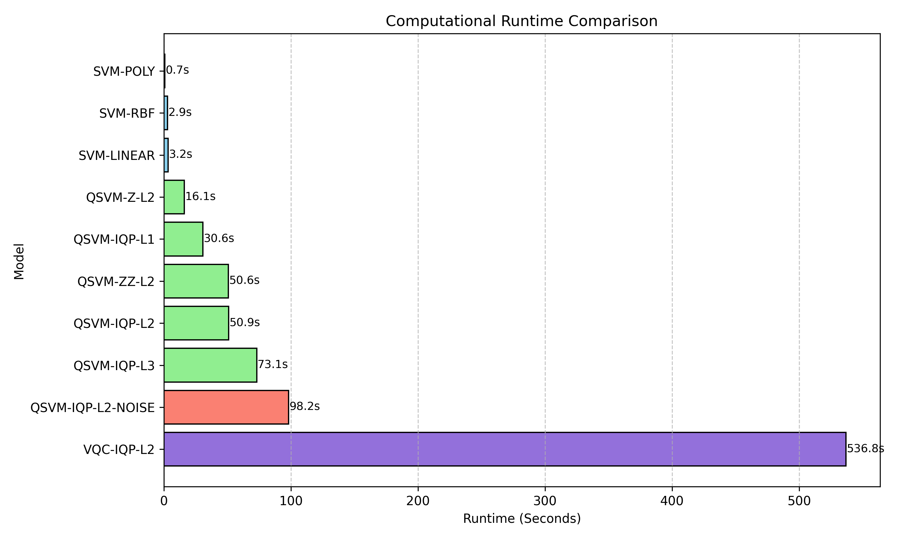

# Quantum Machine Learning for Tropical Cyclone Intensity Classification

This repository contains an end-to-end Python implementation of a Quantum Support Vector Machine (QSVM) pipeline for classifying the severity of tropical cyclones. Utilizing the global IBTrACS dataset, this project benchmarks specialized quantum feature maps—specifically Instantaneous Quantum Polynomial (IQP) circuits—against classical SVM algorithms and Variational Quantum Classifiers (VQC), showcasing the potential and current limitations of quantum-enhanced methods for meteorological event classification.

## 🌪️ Project Overview

Predicting and classifying the intensity of tropical cyclones is a computationally complex problem. This project investigates whether mapping meteorological features into a high-dimensional quantum Hilbert space can provide a linear separation advantage over classical feature mapping techniques.

We classify storm conditions into three distinct categories based on maximum sustained wind speed:
- **Tropical System (TS):** < 64 knots
- **Moderate Hurricane (MH):** 64 - 95 knots
- **Severe Hurricane (SH):** ≥ 96 knots

The pipeline downloads raw IBTrACS v4 data, processes six core atmospheric features, constructs quantum feature maps manually (depth $L$ IQP, ZZ, Z), computes kernel overlap matrices natively via Qiskit's exact Statevector algorithms, benchmarks against Qiskit Aer depolarizing noise, evaluates Variational Quantum Classifiers, and explores out-of-distribution generalisation against NOAA and ERA5 climates matrices.

## 🚀 Key Features

*   **Automated Data Pipeline:** `data_loader.py` securely downloads and caches the latest IBTrACS archives, intelligently selecting core observations required for modeling. Now expanded to parse ERA5 and NOAA climate matrices for out-of-distribution evaluations.
*   **Robust Preprocessing:** `preprocessing.py` implements GroupShuffle splits (grouped by Storm ID to prevent leakage), class balancing through undersampling, and zero-mean standardisation with $[\,0, \pi]\,$ mapping. 
*   **Manual IQP Construction:** `iqp_feature_map.py` builds parametrised depth-$L$ IQP circuits step-by-step for complete mathematical control.
*   **Statevector Kernel Overlaps:** `quantum_kernels.py` leverages vectorized inner-product operations on statevectors simulating the quantum space, offering mathematically exact matrix formulations bypassing physical shot noise.
*   **Hardware Noise Simulation:** `quantum_kernels.py` embeds functional Qiskit Aer depolarising noise constraints natively injecting gate deteriorations to assess true hardware stability.
*   **Variational Quantum Classifier (VQC):** `vqc_baseline.py` establishes native ParameterVector training paradigms mapping identical IQP states structurally into RealAmplitudes rotations using COBYLA tracking.
*   **Comprehensive Baselines:** `classical_baselines.py` evaluates Linear, 3rd-degree Polynomial, and Radial Basis Function (RBF) classical kernels under robust 5-fold cross-validation grid searches.
*   **Temporal Runtimes Profiling:** Master scripts natively trace explicit computational wall-clock cycles isolating classical vector matrices natively from dimensional quantum degradation blocks.

## 🛠️ Architecture

```
Quantum-cyclone-implementation/
├── requirements.txt
├── src/
│   ├── data_loader.py         # IBTrACS/ERA5/NOAA download & primary filtering
│   ├── preprocessing.py       # Grouped stratified split, balancing, standardization 
│   ├── iqp_feature_map.py     # Custom IQP circuit construction
│   ├── quantum_kernels.py     # Statevector evaluations and Aer Depolarizing Noise models
│   ├── vqc_baseline.py        # Optimised Variational Quantum Classifier configurations
│   ├── classical_baselines.py # Baseline SVM cross-validation and hyperparameter selection
│   ├── evaluation.py          # Cohen's Kappa, Macro-F1, aligning scores
│   ├── visualisation.py       # Heatmaps, Depth analysis, and Runtime Bar Charts
│   └── run_experiment.py      # Master execution orchestrator
├── figures/                   # Output folder for generated analysis charts
└── results/                   # JSON logs of trial runs and metrics
```

## 📦 Installation & Usage

It is recommended to run this project in a localized Python virtual environment. Python 3.10+ is required.

1. **Clone the repository:**
   ```bash
   git clone https://github.com/your-username/quantum-cyclone-classification.git
   cd quantum-cyclone-classification
   ```

2. **Initialize Environment & Install Dependencies:**
   ```bash
   python -m venv venv
   source venv/bin/activate  # On Windows: .\venv\Scripts\activate
   pip install -r requirements.txt
   ```

3. **Run the End-to-End Experiment:**
   ```bash
   python src/run_experiment.py
   ```

## 📊 Experimental Results

Using Qiskit's `AerSimulator`, exact statevectors and density matrices were generated. The tests map Quantum Support Vector classifications and VQC dynamics explicitly against Classical tracking.

| Method            | Depth | Accuracy | F1    | Alignment | Runtime (s) |
|-------------------|-------|----------|-------|-----------|-------------|
| SVM-Linear        | ---   | 100.00%  | 1.000 | 0.1332    | 3.24        |
| SVM-Poly          | ---   | 99.93%   | 0.999 | 0.1490    | 0.74        |
| SVM-RBF           | ---   | 99.96%   | 0.999 | 0.2010    | 2.93        |
| **QSVM-Z**        | 2     | 96.87%   | 0.935 | 0.2657    | 16.14       |
| **QSVM-ZZ**       | 2     | 83.94%   | 0.725 | 0.1056    | 50.63       |
| **QSVM-IQP**      | 1     | 96.12%   | 0.929 | 0.2195    | 30.63       |
| **QSVM-IQP (Best)**| 2    | 93.62%   | 0.883 | 0.1679    | 50.92       |
| **QSVM-IQP**      | 3     | 92.82%   | 0.870 | 0.1648    | 73.10       |
| **Noisy QSVM-IQP**| 2     | 94.20%   | 0.897 | 0.1778    | 98.17       |
| **VQC-IQP**       | 2     | 82.11%   | 0.514 | 0.0000    | 536.76      |

### Generated Visualizations

**Normalised Confusion Matrix (QSVM-IQP L=2)**
This heatmap maps the model's predictive class probabilities across TS, MH, and SH ground truths.


**Circuit Depth Analysis**
Illustrates the effect of augmenting quantum layer depth $L$ for the Instantaneous Quantum Polynomial map.


**Runtime Analysis**
Evaluates computational cost structures spanning classical operations toward unentangled maps and density degradation loops.


## 🤝 Contributing

While this repository is primarily meant to act as a structured snapshot of a finished Quantum Machine Learning framework, contributions bridging additional quantum circuit topologies (like Hardware Efficient Ansätze) or optimizing K-matrix computation strategies (perhaps with Qiskit Primitives) are highly welcomed! Feel free to open issues or submit Pull Requests.

## 📄 License

This project is licensed under the MIT License. Data provided via [NOAA's IBTrACS](https://www.ncei.noaa.gov/products/international-best-track-archive).
