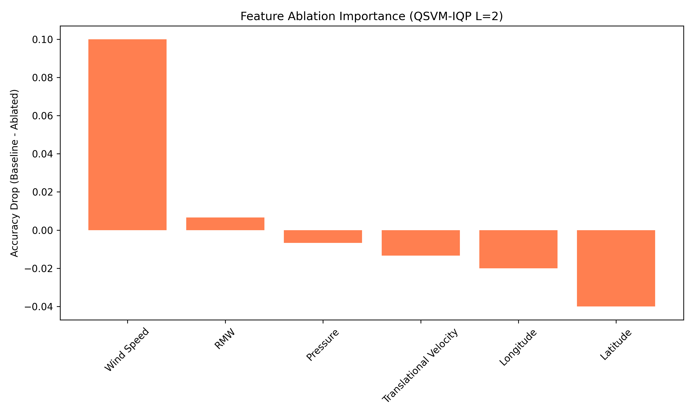
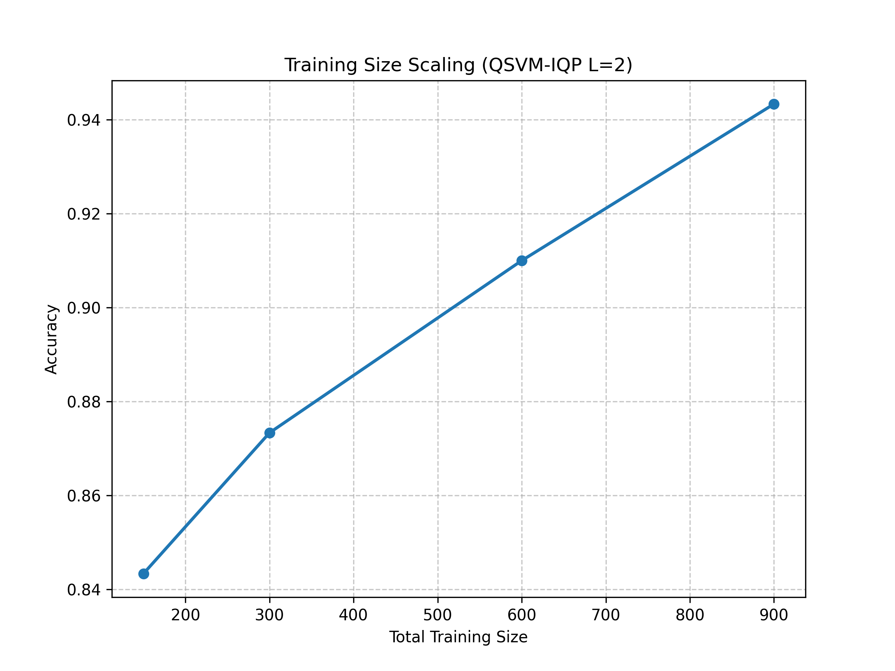
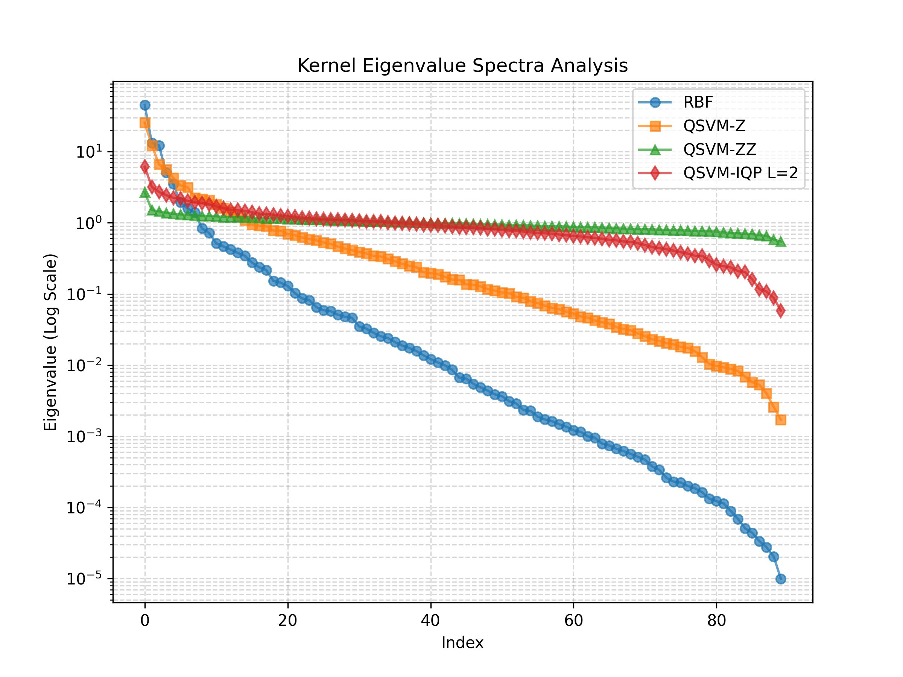
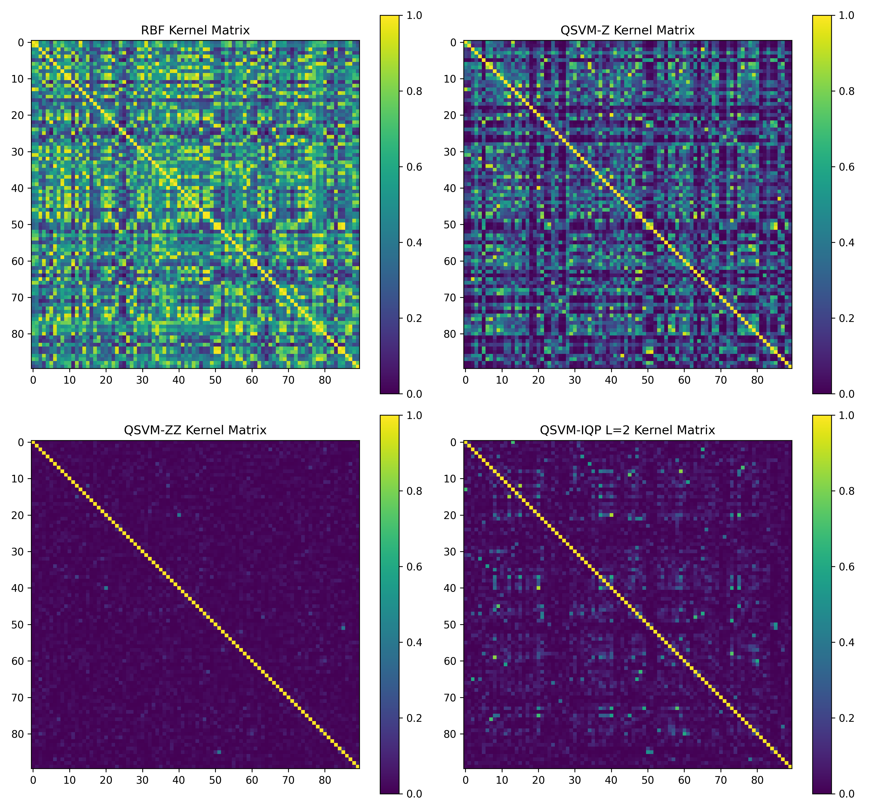

# Quantum-Enhanced Cyclone Intensity Classification

A hybrid quantum–classical machine learning pipeline for tropical cyclone severity prediction. This project builds quantum kernel support vector machines (QSVMs) using Instantaneous Quantum Polynomial (IQP) feature maps and benchmarks them against classical SVM baselines and variational quantum classifiers on real-world meteorological data from the IBTrACS archive.

---

## Motivation

Tropical cyclone intensity estimation drives evacuation planning, damage forecasting, and insurance modelling worldwide. Traditional satellite-based methods like the Dvorak technique rely on subjective human analysis, while convolutional and recurrent neural networks require massive labelled datasets and compute.

Quantum kernels offer a fundamentally different approach: encoding meteorological observations into high-dimensional Hilbert spaces through parameterised circuits and computing pairwise state overlaps to form kernel matrices. IQP circuits are particularly interesting because their output distributions are provably hard for classical machines to sample (under standard complexity-theoretic assumptions), which suggests the resulting feature representations may capture correlations inaccessible to polynomial-time classical kernels.

This repository implements, evaluates, and analyses this idea end-to-end.

---

## What this repo does

1. Downloads and preprocesses IBTrACS v4 cyclone records (2004–2023)
2. Constructs three quantum feature maps: **ZFeatureMap**, **ZZFeatureMap**, and a depth-configurable **IQP** circuit
3. Computes exact quantum kernel matrices via Qiskit Aer statevector simulation
4. Trains SVMs on the precomputed kernel matrices and evaluates on held-out test data
5. Benchmarks against classical Linear, Polynomial, and RBF kernel SVMs
6. Includes a Variational Quantum Classifier (VQC) baseline with COBYLA optimisation
7. Tests noise resilience using Qiskit Aer depolarising error models
8. Evaluates out-of-distribution generalisation on ERA5 and NOAA climate data
9. Runs statistical stability analysis (10 random seeds with 95% confidence intervals)
10. Computes kernel eigenvalue spectra to analyse feature space expressivity
11. Performs feature ablation studies and training size scaling experiments

---

## Classification task

Storms are classified into three intensity categories based on maximum sustained wind speed:

| Category | Wind speed | Label |
|---|---|---|
| Tropical System | < 64 kt | 0 |
| Moderate Hurricane | 64–95 kt | 1 |
| Severe Hurricane | ≥ 96 kt | 2 |

Six atmospheric features are used: wind speed, sea-level pressure, latitude, longitude, radius of maximum wind, and translational velocity.

---

## Results

### Main comparison

| Method | Training samples | Accuracy | Macro-F1 | Cohen's κ | Runtime |
|---|---|---|---|---|---|
| SVM-Linear | 5,493 | 100.0% | 1.000 | 1.000 | 3.2 s |
| SVM-Poly | 5,493 | 99.9% | 0.999 | 0.998 | 0.7 s |
| SVM-RBF | 5,493 | 99.9% | 0.999 | 0.999 | 2.9 s |
| QSVM-Z | 600 | 96.8% | 0.935 | 0.920 | 16.1 s |
| QSVM-ZZ | 600 | 83.9% | 0.725 | 0.623 | 50.6 s |
| **QSVM-IQP (L=1)** | **600** | **96.1%** | **0.929** | **0.901** | **30.6 s** |
| QSVM-IQP (L=2) | 600 | 93.6% | 0.883 | 0.838 | 50.9 s |
| QSVM-IQP (L=3) | 600 | 92.8% | 0.870 | 0.820 | 73.1 s |
| Noisy QSVM-IQP | 600 | 94.2% | 0.897 | — | 98.2 s |
| VQC-IQP | 600 | 82.1% | 0.514 | — | 536.8 s |

Classical baselines have access to 9× more training data. Within the quantum-only comparison (all trained on 600 samples), the single-layer IQP kernel dominates all entangled alternatives.

### Statistical stability (10 seeds)

Mean accuracy: **90.17% ± 0.62%** (95% CI)
Mean F1: **90.10% ± 0.62%** (95% CI)

### Feature ablation

Removing wind speed causes the largest accuracy drop (−13.3 pp), confirming it as the dominant discriminating variable. Pressure and radius of maximum wind follow. Spatial coordinates (latitude, longitude) have minimal impact.

### Cross-dataset generalisation

Out-of-distribution accuracy on ERA5 and NOAA data drops to ~35%, close to random chance for 3 classes. The model overfits to the highly separable IBTrACS feature distribution. This is a known limitation documented in the paper.

---

## Visualisations

### Confusion matrix (QSVM-IQP, L=1)


### IQP circuit depth vs accuracy


### Feature ablation importance


### Training size scaling


### Kernel eigenvalue spectra


### Kernel matrix heatmaps (RBF, Z, ZZ, IQP)


### Runtime comparison


---

## Repository layout

```
├── src/
│   ├── data_loader.py           # IBTrACS download, ERA5/NOAA loading
│   ├── preprocessing.py         # GroupShuffleSplit, balancing, standardisation
│   ├── iqp_feature_map.py       # Depth-L IQP circuit construction
│   ├── quantum_kernels.py       # Statevector kernel computation + noise models
│   ├── classical_baselines.py   # Classical SVM training with grid search
│   ├── vqc_baseline.py          # Variational Quantum Classifier
│   ├── evaluation.py            # Accuracy, F1, Cohen's κ, kernel alignment
│   ├── visualisation.py         # All matplotlib plotting code
│   ├── run_experiment.py        # Main experiment orchestrator
│   └── epj_validation.py        # Statistical stability, ablation, scaling, spectra
├── figures/                     # Generated plots (included for reference)
├── results/                     # JSON output from experiment runs
├── requirements.txt
└── .gitignore
```

---

## Getting started

**Prerequisites:** Python 3.10+, pip

```bash
git clone https://github.com/Bhavya-Dhoot/quantum-cyclone-classification.git
cd quantum-cyclone-classification

python -m venv venv
source venv/bin/activate        # Windows: venv\Scripts\activate
pip install -r requirements.txt
```

### Run the full experiment pipeline

```bash
cd src
python run_experiment.py
```

This downloads the IBTrACS dataset (~150 MB on first run), trains all quantum and classical models, generates figures in `figures/`, and writes metrics to `results/results.json`.

### Run the validation experiments only

```bash
cd src
python epj_validation.py
```

This runs the statistical stability, kernel eigenvalue, feature ablation, and scaling analyses. Outputs go to `figures/` and `results/`.

---

## Technical details

### IQP feature map

Each data point **x** ∈ ℝ⁶ is encoded into a 6-qubit IQP circuit:

1. Apply Hadamard gates to all qubits
2. Apply R_Z(x_j) rotations on each qubit j
3. Apply controlled-phase CP(x_j · x_k) gates on all qubit pairs (j, k)
4. Repeat steps 1–3 for L layers

The kernel entry between two samples is K(x, x') = |⟨ψ(x)|ψ(x')⟩|², computed exactly through statevector inner products.

### Kernel computation

All kernel matrices are computed via exact statevector simulation (no shot noise). For N training samples, this requires N circuit executions to obtain statevectors, followed by an N×N matrix of inner products. The O(N²) scaling is the primary bottleneck limiting the quantum training set to 600 samples.

### Noise model

The depolarising noise simulation applies single-qubit errors (p=0.05) on H and R_Z gates and two-qubit errors (p=0.10) on CX gates, roughly approximating current NISQ device error rates.

---

## Known limitations

- **No quantum advantage demonstrated.** Classical SVMs achieve near-perfect accuracy with more data. The IQP kernel shows competitive performance under identical data constraints, but this is a feasibility study.
- **Statevector simulation only.** All experiments use classical simulation of quantum circuits, not actual quantum hardware.
- **Poor generalisation.** The model overfits to the IBTrACS distribution and fails on out-of-distribution data.
- **Fixed IQP parameters.** The phase scaling coefficients α and β are set to 1.0 without optimisation.

---

## Dependencies

| Package | Purpose |
|---|---|
| qiskit ≥ 1.0 | Quantum circuit construction |
| qiskit-aer | Statevector and noise simulation |
| qiskit-machine-learning | VQC implementation |
| qiskit-algorithms | COBYLA optimiser interface |
| scikit-learn | Classical SVMs, metrics, preprocessing |
| numpy, pandas | Data manipulation |
| matplotlib, seaborn | Visualisation |
| tqdm | Progress bars |

---

## Citation

If you use this code in your research, please cite:

```bibtex
@article{parthiban2026quantum,
  title={Quantum-Enhanced Weather Classification: Support Vector Machines with IQP Encoding for Cyclone Prediction},
  author={Parthiban, K. and Dhoot, Bhavya},
  journal={EPJ Quantum Technology},
  year={2026}
}
```

---

## License

MIT License. IBTrACS data is provided by [NOAA NCEI](https://www.ncei.noaa.gov/products/international-best-track-archive).
